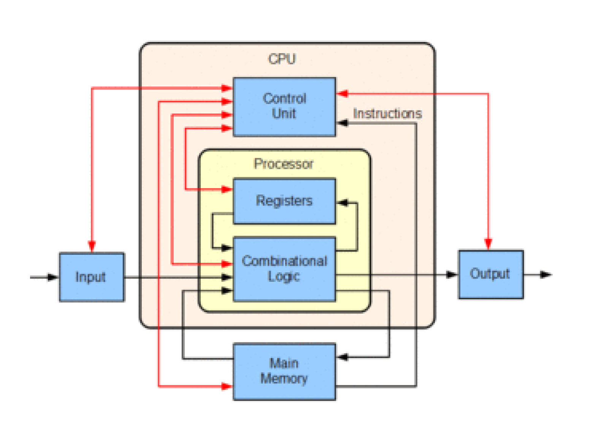
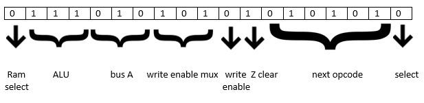
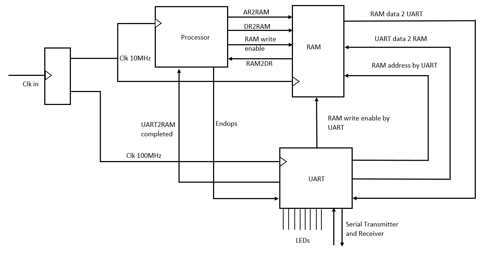
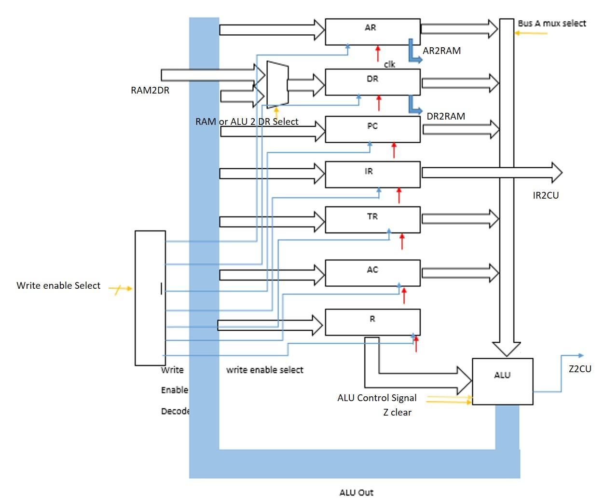
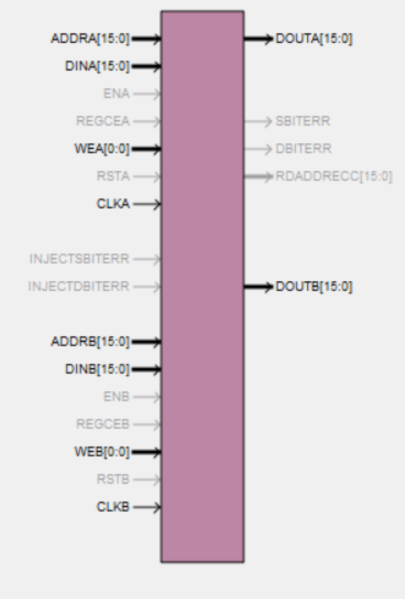
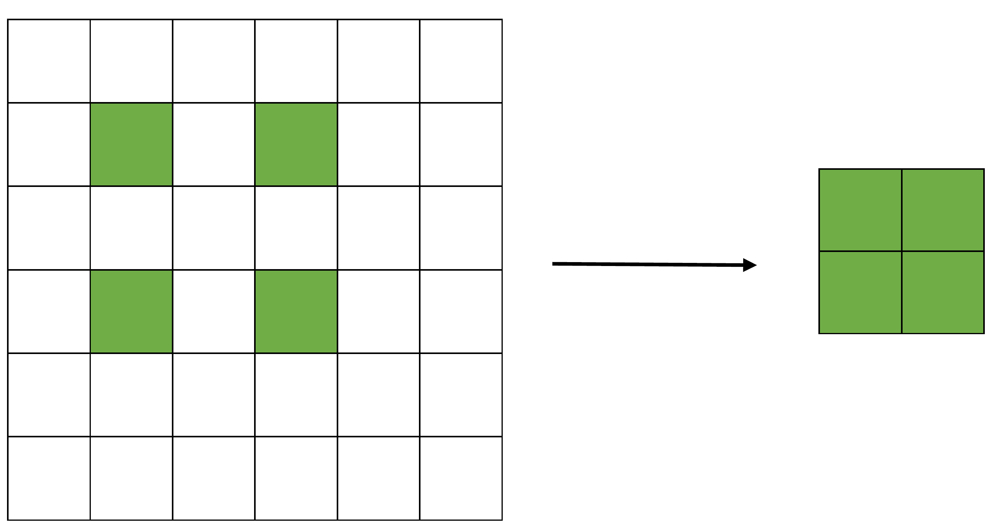
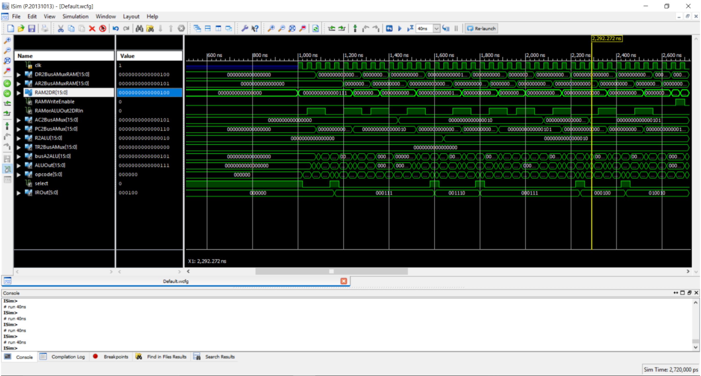
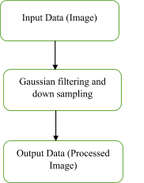
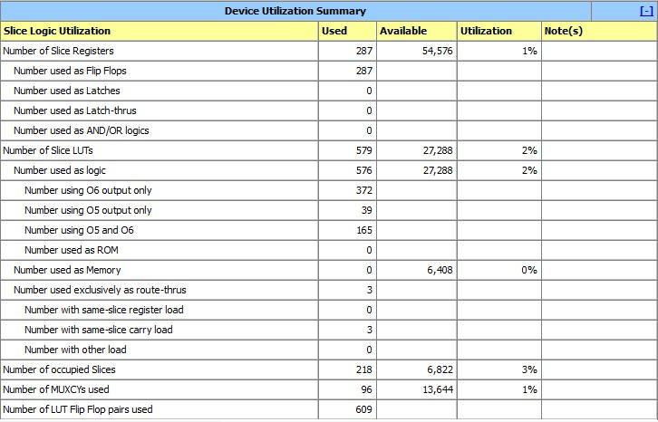
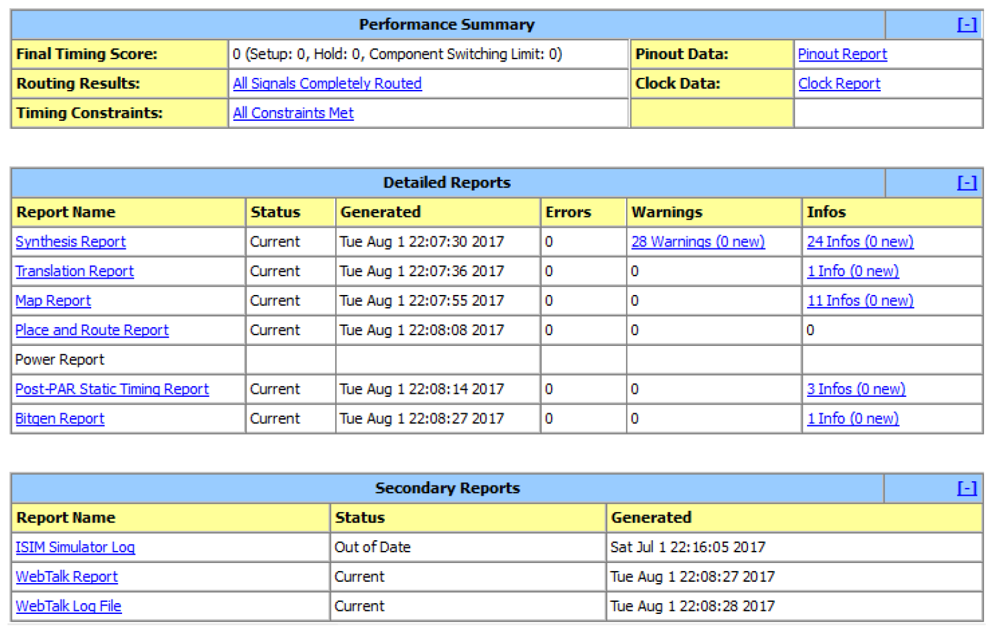

# 16-bit Processor
## Contents 

1. Introduction
    1. Processor and CPU design
    2. Task
2. Instruction set architecture
    1. Instruction set
    2. Fetch decode execute cycle
    3. State diagram of the CPU
3. Modules
    1. Top Module
    2. Processor
    3. Processing Unit
    4. Registers
    5. Arithmetic Logic Unit (ALU)
    6. BusAMUx
    7. Write Enable Decoder
    8. Control Unit
    9. RAM
    10. Clocking module
    11. UART Module
4. Algorithm
    1. Introduction
    2. Matlab Code Used for Verification
    3. Assembly Code Used
5. Testing, Simulations and Modifications
    1. Testing & Simulations
    2. Modifications
6. Result Analysing And Verification
    1. Generate Reference Output Image
    2. Results Verification And Analysis
    3. Error Analysis
7. Design Summary
8. Appendices
    1. Appendix I Verilog Code

## 1. Introduction 
The process of something in software usually takes particular amount of time to get processed since it is executed sequentially. But in most of the applications like high speed image processing applications less processing time is expected. In that case we need parallel processing which cannot be done at software level. Therefore we need to do it at hardware level to reduce the processing time. The main objective of this project is to design a processor and CPU (central processing unit) which is for doing a specific task and simulate it using the Verilog hardware description language and at last to implement it in hardware by using FPGA (Field Programmable Gate Array).This report describes about the processor and CPU design, the test codes (MATLAB code and Verilog code) used for verifications and the physical hardware implementation. 

### 1.1 Processor and CPU design 
The central processing unit (CPU) is an electronic circuitry within the computer that performs arithmetic, logical, control and input/output (I/O) operations to carry out the instructions of a computer program. Processing unit and control unit are the two fundamental components of a CPU. The principal components of processing unit includes arithmetic logic unit (ALU) that performs arithmetic and logic operations and processor registers that supply operands to the ALU and store the results of ALU operations. The control unit orchestrates the fetching (from memory) and execution of instructions by directing the coordinated operations of the ALU, registers and other components (Multiplexer and decoders).The processor is a register based, clock driven, multipurpose programmable electronic device which accepts binary data as input and process it according to the instructions stored in memory and provides the result as output. Processor incorporates the functions of central processing unit (CPU) of a computer on a single or few integrated circuits. The processor contains both combinational and sequential logic.  


*Basic block diagram of CPU*

### 1.2 Task  
Implementing a processor and CPU design to give the output as filtered and down sampled image of the given input image. 


For the completion of this task, first the CPU should get data from the serial input and save to main memory. Then do the processing part. After processing the processed data should be returned to the memory and finally the result should be displayed. This main task consists of three sub tasks. 

* <b>Controlling and storing input data signal in main memory</b><br/>
This task include the UART implementation in FPGA. First serial data is sent to the UART port by serial data transmitting software (MATLAB) and it is received by implemented UART receiver using Verilog in FPGA. At last received data is stored in the main memory which is already implemented in FPGA. 

* <b>Filtering and Down sampling the saved image</b><br/>
High frequency components in the image could be problematical for the accuracy of the image after down sampling. Therefore the saved image is filtered and down sampled to reduce the effect of high frequency components in the image. These processes (filtering and down sampling) are implemented on the FPGA. The processed data is stored in the main memory.

* <b>Controlling and displaying the processed image</b><br/>
UART transmitter is implemented on the FPGA to get the processed data from FPGA to computer. MATLAB is used to collect the data. 

In our project Xilinx FPGA design suite is used for the implementation of the particular task specified processor. 
* Processing the data in minimum time 
* Simplicity of the architecture 
* Using the memory in efficient manner are the factors that we considered while implementing the processor. 

 After the implementation of the processor, the processed output image should be compared with the output image processed image by the MATLAB. The pixel value of two output images is also compared for the verification. There were some limitations of input in our case. Because of the limited memory capacity we were able to give a grey color image with the maximum resolution of 200x200 as the input. And finally the SSD (Sum of Squared Difference) value of the two output image arrays is calculated by the following equation 


Where f and g refer the two images. If this value is equal to zero then the two images are perfectly similar. Moreover an array of difference of relative pixel values also obtained and if it is equal to zero array then it ensures the verification.  

## 2. Instruction set architecture  
A 16-bit processor architecture was designed for the purpose of filtering and down sampling an image with 8-bit pixel values. MIC-1 architecture was chosen as a reference. The basic components in the architecture are,

1. Registers 
    1. PC – Program counter which holds the address of the next instruction in the ram. 
    2. AR – Address Register which supplies address to the ram. 
    3. R– General purpose register. 
    4. IR – Instruction Register which stores the instruction taken from the ram. 
    5. DR, TR – General Purpose Registers. 
    6. AC – Accumulator which has the direct access to the ALU. 
2. ALU – where every single operation is done 
3. RAM– memory element where the data and instruction is stored 
4. Control unit – which has the micro instruction 
5. UART Communications – which is used to communication between the processor and the computer. 

RAM has memory locations of length 16-bit and each byte is addressable. The memory bus is 16-bit. ALU is 16-bit and the registers are 16-bit. ALU takes two inputs and one is fixed input from AC and the other is from R.  


### 2.1 Instruction set  
The processor has 6 bit instruction. The instruction table is shown below  

<table>
  <tr>
   <td><strong>Instruction</strong>
   </td>
   <td><strong>opcode</strong>
   </td>
  </tr>
  <tr>
   <td>FETCH1 
   </td>
   <td>000000 
   </td>
  </tr>
  <tr>
   <td>ADD1 
   </td>
   <td>000100 
   </td>
  </tr>
  <tr>
   <td>SUB1 
   </td>
   <td>000101 
   </td>
  </tr>
  <tr>
   <td>NOP  
   </td>
   <td>000110 
   </td>
  </tr>
  <tr>
   <td>LDAC1 
   </td>
   <td>000111 
   </td>
  </tr>
  <tr>
   <td>MVAC2R1 
   </td>
   <td>001110 
   </td>
  </tr>
  <tr>
   <td>MVR2AC1 
   </td>
   <td>001111 
   </td>
  </tr>
  <tr>
   <td>MVAC2TR1 
   </td>
   <td>010000 
   </td>
  </tr>
  <tr>
   <td>MVTR2DR1 
   </td>
   <td>010001 
   </td>
  </tr>
  <tr>
   <td>STAC1 
   </td>
   <td>010010 
   </td>
  </tr>
  <tr>
   <td>JUMP1 
   </td>
   <td>011000 
   </td>
  </tr>
  <tr>
   <td>JUMPNZ 
   </td>
   <td>011100 
   </td>
  </tr>
  <tr>
   <td>CLAC1 
   </td>
   <td>100000 
   </td>
  </tr>
  <tr>
   <td>LSHIFT1 
   </td>
   <td>100001 
   </td>
  </tr>
  <tr>
   <td>RSHIFT1 
   </td>
   <td>100010 
   </td>
  </tr>
  <tr>
   <td>ENDOPS 
   </td>
   <td>100011 
   </td>
  </tr>
  <tr>
   <td>LOAD1 
   </td>
   <td>100100 
   </td>
  </tr>
  <tr>
   <td>MVTR2AC1 
   </td>
   <td>101000 
   </td>
  </tr>
</table>

Our processor micro instruction is 19 bits long  



These micro instruction is hard coded in the control unit. So according to the opcode it can give the micro instruction to ALU, Bus A, write enable mux, and the next opcode to the processing unit. 

### 2.2 Fetch decode execute cycle 
Opcode for fetch1 is given as 000000 for the first time fetch is executed and looking at the control unit the next opcode is taken and there is a select bit assigned in the micro instruction. If the select bit is 1 the opcode is taken from the Instruction Register. And if the select bit is 0 the next opcode is taken from the micro instruction itself. 

Select bit is 1 in only one occasion when fetch is over the instruction in the IR register must be executed.  

#### Fetching instruction 
Fetching instruction consist of 4 stages
```
Fetch1 -   AR<=PC 
Fetch2 -   DR<=RAM, PC<=PC+1 
Fetch3 -   wait 
Fetch4 -   IR<=DR
```

#### Decoding instruction 
After fetching instructions from the instruction memory, the CPU has to identify which instruction has been fetched thereby invoking the correct execution cycle. This task is done by the controlling unit. 

#### Executing instruction 
* ADD instruction\
ADD instruction can be executed by one stage\
`AC<=AC+R`
* SUB instruction\
SUB instruction can be also executed by one stage\
`AC<=AC-R`
* NOP instruction\
NOP instruction can be also executed by one stage.\
This operation does nothing. It increments PC by one\
`PC<=PC+1`
* LDAC instruction\
LDAC instruction can be executed in 7 stages.
    ```
    LDAC1 - AR<=PC
    LDAC2 - DR<=RAM, PC<=PC+1
    LDAC3 - WAIT
    LDAC4 - AR<=DR
    LDAC5 - DR<=RAM
    LDAC6 - WAIT
    LDAC7 - AC<=DR
    ```
* MVAC2R, MVR2AC, MVAC2TR, MVTR2DR, MVTR2AC instructions\
These instructions can be done in one stage. 
    ```
    R<=AC
    AC<=R
    TR<=AC
    DR<=TR
    AC<=TR
    ```
* STAC instruction\
STAC instruction can be executed in six stages. 
    ```
    STAC1 - AR<=PC
    STAC2 - DR<=RAM, PC<=PC+1
    STAC3 - WAIT
    STAC4 - AR<=DR
    STAC5 - DR<=AC
    STAC6 - RAM<=DR
    ```
* JUMP instruction\
JUMP instruction can be executed in four stages.
    ```
    JUMP1 - AR<=PC
    JUMP2 - DR<=RAM, PC<=PC+1
    JUMP3 - WAIT
    JUMP4 - PC<=DR
    ```
* JUMPNZ instruction\
JUMPNZ instruction can be executed in four stages. This instruction will be executed when flag Z=0  
    ```
    JUMPNZ1 - AR<=PC
    JUMPNZ2 - DR<=RAM, PC<=PC+1
    JUMPNZ3 - WAIT
    JUMPNZ4 - PC<=DR
    ```
    When flag Z=1 
    `PC<=PC+1`
* CLAC instruction\
CLAC instruction can be executed in a stage. It is used to clear the accumulator.
`AC<=0`
* LSHIFT,RSHIFT instruction\
These instructions can be done in one stage. AC is shifted by a value in the R register. 
    ```
    AC<=AC<<R
    AC<=AC>>R 
    ```
* LOAD instruction\
LOAD instruction can be done in four stages\
This is used fetch the data from the RAM with the address that accumulator hold. 
    ```
    LOAD1 - AR<=AC
    LOAD2 - DR<=RAM
    LOAD3 - WAIT
    LOAD4 - AC<=DR
    ```

### 2.3 State diagram of the CPU


## 3. Modules 

### 3.1 Top Module 
This contains all the sub units that makes up our system. It houses the Processor, RAM, UART module and a clocking module. The processor is the main heart of our system. While the RAM is a two port RAM interfaced with the processor and UART module. The UART module is used for data transmission with an external computer. The clocking module is used to down sample the clock and make it robust. 

The top module is interfaced with the board as follows.  
* The clock input is connected to the onboard clock which runs at 100MHz. 
* The serial receiver and transmitter is connected with the micro USB port for serial communication. 
* Some state indicating outputs are connected to onboard LEDs. 


*Figure 3. 1 External View of Top Module*


*Figure 3. 2 Internal Organization of the Top module*

### 3.2 Processor  
This is the logic circuitry that performs the task at hand namely down sampling an image all the other modules are merely supporting and facilitating the function of the processor. The processor runs at 10MHz. The processor is interfaced with RAM for getting data. It is also interfaced with the UART module to know the status of the UART module and inform its status to the UART module. 

Our Processor implementation is sub divided into two units namely Processing unit and Control Unit. The Processing Unit is comprised of the complete data path (ALU, Registers, Buses etc.) and responsible for performing operations and data manipulation. While the control Unit overlooks the operation by decoding the instructions and releasing the control signals. These units and their sub modules are explained in detail in the following sections. 


*Figure 3. 3 Organization of Sub modules within the processor*

### 3.3 Processing Unit 
The Processing Unit is comprised of the complete data path and responsible for performing operations and data manipulation. It comprises of Registers, Buses Arithmetic Logic Unit, multiplexers, decoders etc. The processing unit is interfaced with RAM through the lines connecting AR and DR to RAM. All the submodules of the processing unit function based on the instructions released by the Control Unit. 

A detailed internal diagram of the Processing unit is shown below.  


*Figure 3. 4 Organization of sub modules inside the Processing Unit*

Each sub module of this section is explained in detail in their respective sections

### 3.4 Registers 
Registers are the modules which are used to store the data inside the processor while processing. There are seven registers in the implementation. Address Register (AR), Data Register (DR), Program Counter (PC), Instruction Register (IR), Accumulator (AC), Two general purpose registers (R, TR). All these registers can hold 16bits of data except IR which holds only 6bits of data. 


*Figure 3. 5 Register*

All the registers are driven by the system clock (which is running at 10MHz). The registers have data_in through which data can be written to the registers. But at any given time the register will accept the data from data_in line only if the write_enable bit (which is another input) is set as high. The data in the registers are always exposed through the data_out line. The data_out of the registers AC, DR, PC, and TR are connected to Bus_A. The data_out of IR goes to the control unit as an input through IR2CU line. The data_out line of AR and DR are connected to RAM module through AR2RAM and DR2RAM respectively. The data_out of the register R is directly connected to ALU. 

#### Accumulator (AC) 
AC is used to store the immediate output of ALU. In our implementation for all arithmetic operations between data one input operand is always stored in AC (refer ISA).  

#### Register (R) 
This is designed as a register that is directly connected to the ALU (refer the Datapath). So, it carries the second operand for all arithmetic operations between data.  

#### Temporary Register (TR) 
This is used as a temporary register to store intermediate results in the short run for some operations. So that it would reduce the latency of memory access. 

#### Program Counter (PC) 
This register always holds the address of the next instruction or address of next data depending on the situation. It is always made sure that it is always incremented at the execution of each instruction. Note that even incrementing PC is done by ALU to avoid loss of generality, so that all the arithmetic and logic operations are done by ALU and registers are synthesized as pure registers. 

#### Instruction Register (IR) 
The IR stores the opcode of the current instruction and releases it to the control unit. The data in the IR is updated at the end of each fetch cycle. 

#### Address Register (AR)  
This register holds the address of memory location, from which data is to be read or to which data is to be written. The output of this is directly connected to the RAM. 

#### Data Register (DR)
This register holds the data which is to be written to the RAM or which is read from the RAM. The output of it is connected to both Bus_A and RAM. The input of it comes through a multiplexer which selects what data is to be written to DR (from RAM or ALU_out) based on the situation. 

Both AR and DR are the interface through which our Processor communicates with the RAM. 

### 3.5 Arithmetic Logic Unit (ALU) 
ALU is the module that handles all the arithmetic and logic operations done in the processor. It has two data inputs and one data outputs. One data input comes directly from R while the other input comes from Bus_A. But usually we have adhered to the common practice of having the other data in AC in case of arithmetic operation. The output of ALU (which is also a bus) can be written to any registers but here too we have kept it strictly to write it to AC when it is an arithmetic operation. The only arithmetic operation that by passes this rule is incrementing PC. 

But the whole point of having BUS_A and ALU_out connected to almost all the register is to enable data movement to happen through ALU. Keeping in line with MIC 1 architecture we have made sure all the process in the processing unit go through ALU. During data movement ALU simply forwards the data_in to data_out.  

Apart from the data inputs and outputs the ALU has few other IOs. The main one being ALU_control signal which is a 3bit control signal released by the Control Unit based on the current micro instruction. Based on the control signal the following operations are executed by the ALU. 

* 000  	: NOP  	dataOut <= dataIn 	 	(used for data movement) 
* 001  	: ADD  	dataOut <= RIn + dataIn 
* 010  	: SUB  	dataOut <= dataIn-RIn 
* 011  	: LSHIFT 	 	dataOut <= dataIn << RIn 
* 100  	: RSHIFT 	dataOut <= dataIn >> RIn 
* 101  : MOVR  dataOut <= Rin   (used for moving data from R) 
* 110  : INC  data = dataIn + 1  (primarily used for incrementing PC) 

Z flag is another output raised by ALU whenever the output of ALU becomes zero. This is used by the Control Unit whenever it wants to decide (e.g. JUMPNZ). Since Z is a flag (1bit register) it will hold the value until cleared. So, Control Unit has another dedicated bit, ZClear, which comes as an input to the ALU which will instruct the ALU to clear Z flag. 

 
*Figure 3. 6 ALU*

### 3.6 BusAMUx 
As mentioned in the registers section the output of AR, DR, PC, TR, and AC are connected to the ALU input through BusA. So BusA should be able to forward one of the four inputs to its output (which is an input to the ALU). Hence BusA is modelled as a multiplexer so that it can forward one of the inputs to its output based on the control signal. The control signal to the busA is a 3bit control signal released by the Control Unit based on the current micro instruction.

```
000: AC
001: AR
010: PC
011: DR
100: TR 
```

### 3.7 Write Enable Decoder 
As discussed in the ALU section, in our implementation data movement is happening through ALU. Hence, we must select the register to which the data should be written in the time. Each register has its own write enable pin but having dedicated bits for each register would cost us 7bits in the control signal issued by the Control Unit. So, we have gone with the design choice of having a decoder which will receive a 3 bit control signal from the Control Unit and based on the signal enables only one register for the data to be written to. 

### 3.8 Control Unit 
Control Unit is the part of the processor that directs the operation of the processor. It releases control signals to various other units like ALU, registers, buses, memory etc. and control their operations. The control signal released by the Control Unit is based on the opcode of current instruction or micro instruction. 

The control unit is driven by the system clock (10MHz). Apart from the clock, it has two inputs interfacing it with the Processing Unit, namely Z2CU IR2CU. As discussed earlier IR2CU is a 6bit line which carries the opcode of the current instruction from the Instruction Register. Z2CU is the 1bit line that indicates the state of the zero flag to the Control Unit. So that it can be used to take decisions.  

Also, it has one input connection from the UART module. Since, the UART module is operating independent of the Processor (It is directly interfaced with the PC), there is a signal from UART module to indicate that the communication with the PC is done and the values are written to the RAM. Only after this bit is set high our Processor starts to function. That is, the Control Unit will be issuing control signals after getting this signal from UART module. This signal is named UART2RAMcompleted.  

Similarly, it has an output bit interfaced with the UART module named ENDOPS. This indicates the end of the processing by the processor, so that the UART module can transmit back the result to the PC. 

The main output of the Control Unit is the instruction which is 19bit long. It carries instruction to various sub units. It can be broken down as follows. 

<table>
  <tr>
   <td>
    RAM or ALU out to DR 
   </td>
   <td>
    ALU Control Signal 
   </td>
   <td>
    Bus Mux select 
   </td>
   <td>A 
   </td>
   <td>
    Write Enable Decoder  
   </td>
   <td>
    RAM Write Enable 
   </td>
   <td>
    Z clear  
   </td>
   <td>
    Next opcode 
   </td>
   <td>
    Select Bit 
   </td>
  </tr>
  <tr>
   <td>
    1 bit 
   </td>
   <td>
    3 bits 
   </td>
   <td>
    3 bits 
   </td>
   <td>
   </td>
   <td>
    3 bits 
   </td>
   <td>
    1 bit 
   </td>
   <td>
    1 bit 
   </td>
   <td>
    6 bits 
   </td>
   <td>
    1 bit 
   </td>
  </tr>
</table>

#### RAM or ALU out to DR  
This bit is used to decide data from which line (RAM or ALU out bus) should be written to Data Register. 

#### ALU Control Signal 
As discussed in ALU section this 3bit signal decides what operation should performed by the ALU. 

#### Bus A Mux Select 
This signal controls Bus A. Based on this signal output of one of the registers is forwarded to the input of ALU through Bus A. 

#### Write Enable Decoder Select 
This signal goes as an input to the Write Enable Decoder and chooses which register should be enabled for writing. 

#### RAM Write Enable 
This 1bit signal enables the processor to write to the RAM. When this bit is set the data in DR is written to the memory location in AR. 

#### Z clear
This bit used to clear the Z flag set by ALU. 

#### Next opcode and Select bit 
As discussed in ISA section, our instructions have several micro instructions. So, when a new instruction is fetched we have to execute the opcode that is present in IR. But when we are executing a particular instruction we know exactly what would be the opcode of the next micro instruction. So, in cases when the next opcode is known it is fixed in the control signal itself.  

The Select bit is used to select whether to execute the opcode in the IR or to use the one in the next opcode field. This is set high only at the last micro instruction of the fetch cycle. 

### 3.9 RAM  
The RAM module is the primary memory used in our system. It is used to store both the instructions (program) and the data.


*Figure 3. 7 Dual Port RAM*

The RAM is designed with 16bit address so that it can cater 65536 memory locations. Each of this memory locations are 16bit wide. The processor implemented by us is designed as a twoport memory. This is done to offer two independent interfaces for the UART module and processor to access the RAM. Each interface has 4 inputs and 1 output. The input lines are clock, address (16bit), data_in (16bit), and write_enable (1bit). The output is data_out which is also 16bits wide. 

The clock used is the system clock running at 10MHz. The address line points to the current memory location to which we wish to, write to or rad from. The data_out line always carries the content of the location pointed by the address line. If the write_enable signal is set the data in the data_in line is written to the location pointed by the address. 

The RAM implemented in this system has latency of 1 clock cycle. That is if a read or write signal is triggered by the processor it takes one more clock cycle for the data to be available in the data Register of the processor. This is acceptable and it can be seen in the micro instruction there is always a wait state after triggering the read signals. But some non-relevant task can be done in this idle cycle (like incrementing Programing Counter). 

### 3.10 Clocking module 
This module is an IP Core module which is used to down sample and buffer the clock. The main reason for using this module is to reduce the phase different and physical time delay which may occur due to clock being connected to different modules which are generated at different locations. To achieve this the clocking module makes use of Phase locked loops, global buffers which gives high fan out, digital clock manager.   

The clocking module implemented in our design has one input which is the onboard clock running at 100MHz. Then it outputs two outputs a down sampled clock at 10MHz and another 100MHz clock. We are getting the 100MHz clock to use in UART module from the output of the module rather than from the onboard clock due to the robust features the clocking module can add as mentioned above. 

### 3.11 UART Module 
The UART Module is designed as a finite state machine which incorporates few other sub modules as well. The sub modules are clock divider, transmitter and a receiver. 


*Figure 3. 7 Sub modules of UART*

#### Clock divider (UART) 
This module takes the 100MHz clock as an input and outputs 9600Hz clock which is the baud rate at which the UART is communicating with the external PC. The reason for not making this a part of the IP core clocking module at the top module and just getting the down sampled clock as an input to the UART module is that the IP core clocking module was not able to deliver the exact frequency due to the overhead of universal buffer and phase lock loops. Also, a buffer was not needed since this clock is being used only in one location. 

Hence the clock is implemented as a module that counts at the positive edge of the input clock and flips the input at a certain count (5208). In this way it generates a down sampled clock as its output. 

#### Transmitter  
This module takes a byte of data and transmits it serially bit by bit. This module runs at the speed of the down sampled clock (9600Hz). It takes two inputs data which is 8bit wide and a signal send to trigger the transmit. It has two outputs a serial transmitter line which is interfaced with the serial receiver of the external PC and another flag to indicate that it is busy while in the middle of transmitting a data. The busy flag is used to avoid data collision and corruption. 

When the send bit is set, the transmitter first sets the transmitter line (which is by default high) to low which will indicate the receiving end that a data is about to come. This is called the start bit. Then at the next eight positive edges of the clock it transmits the 8bits of data serially and then sets the transmitter line to high, which is termed as the end bit. Throughout this process the busy flag is set high and at the end of these 10 its it is brought to low. 

#### Receiver 
The receiver module receives the serial data and converts it as an 8bit parallel data and gives it out. Unlike the transmitter module this runs at 100MHz, to offer higher resolution. This has 3 inputs and 2 outputs. The inputs are clock, serial receiver, and a signal to clear. The outputs are 8bit data, a data_ready flag to indicate a new byte is received and available. The clear input is used to clear the data available at the output. 

The receiver operates by constantly checking in its serial receiver line to go down. When the serial receiver line is pulled down by the external PC transmitter it waits for finite time (half bit time) and check again for low value. This is done to ensure that it is the start bit and not a false trigger by some random noise. After this next 8 bits are stored in an internal buffer and final end-bit is ensured to be high. Then if it is ensured, the data in internal buffer is transferred to the data output line and  data ready flag is raised. 

#### State Diagram of the UART module 
As described earlier the UART top module is implemented as a finite state machine and the state diagram of it can be seen below. 


*Figure 3. 8 State Diagram of UART Top Module*

At first (State 0) the top module waits for the data_ready signal to be raised by the receiver sub module. When such it receives the signal, it writes the received data to the ram by forwarding it to the data_in of ram and setting write_enable of ram (State 1). Then in the next state it clears the recieved data increments the address resets the write_enable (State 2). 

Then in state 2 it checks if all the data are received or not. If receiving is completed it moves to state 3 or else it goes back to state 0. In state 3 UART2RAM_completed flag is set so that the processor will start working. Also, in state 3 the variables (like address counter etc.) are reset since they are to be used in transmission too and then put to state 7 where it waits for the endops signal from processor. 

When endops is received the UART top module moves to state 4 where it sends each byte and then moves to state 5 which turns off send to avoid corruption. The UART top module oscillates between these two states till all the required data are sent and then it moves to state six where variables are reset. Finally, the UART top module goes back to state 0. 

## 4. Algorithm 
### 4.1 Introduction 
A custom algorithm was developed based on the following objectives of the program, 
1. Gaussian noise filter the image 
2. Down sample the image to half of the original resolution

There are plenty of resources for the above two tasks. We could find many algorithms which implemented the aforementioned tasks separately. We found a novel way to combine the two tasks in the same algorithm and reduce the generation of unnecessary information. Our algorithm reduces a lot of computational effort by cleverly doing only the necessary calculations. 

Gaussian noise filtering an image involves iterating through every pixel of the image and finding a local average for each pixel using a Gaussian kernel and replacing the original pixel with the Gaussian averaged value. For each pixel we have to do 8 additions and one division if we are to use a 3x3 Gaussian kernel. So for an nxm image we will have to do nxmx8 additions and nxm divisions i.e. totally nxmx9 operations. It is an O(nm) algorithm. 

<table>
  <tr>
   <td>1/16</td>
   <td>1/8</td>
   <td>1/16</td>
  </tr>
  <tr>
   <td>1/8</td>
   <td>1/4</td>
   <td>1/8</td>
  </tr>
  <tr>
   <td>1/16</td>
   <td>1/8</td>
   <td>1/16</td>
  </tr>
</table>

*Figure 4.1 - 3x3 Gaussian kernel*

Down sampling an image can be done in many ways. To down sample to half of the original resolution we can either take alternative pixels along x as well as y axes to create a new image or apply a 2x2 kernel with equal weight to each place and apply the kernel in a non-overlapping fashion and take the values to create a new image. If we decide to take alternative pixels to generate an image it will involve iterating through the nxm image. So again it will be an O(nxm) algorithm. 

Our approach to the problem is applying the Gaussian kernel not to every pixel but to alternative pixels along each axis so that we end up with (n/2)x(m/2) values with can be used to generate a down sampled image. This cuts down the number of operations we have to do by a factor of 2. 

Also note that the Gaussian kernel values are chosen to be inverse of the exponents of 2 because the ALU that was built for the processor doesn’t have an actual division or multiplication operation which are costly. Instead right-shift and left-shift bit-wise operations were incorporated into the ALU to be used in place of division and multiplication respectively. These operations are computationally efficient and require less hardware to realize. Since the requirement of the project was very specific to Gaussian filtering and down sampling to half the original size, costly ALU operations were dropped in favor of shifting with the intention of cleverly exploiting the carefully chosen values for Gaussian kernel. This is not a limitation of the processor, but rather a hardware-efficient way of achieving the project goals. 

\
*Figure 4.2 – Flow chart for the algorithm*


*Figure 4.3 – Illustration of choosing pixels to apply kernel*

In order to avoid edge filtering problems it was decided not to apply the Gaussian kernel to edge pixels. So for a 200x200 image the algorithm will produce 99x99 image.  

### 4.2 Matlab Code Used for Verification 
```
[m,n] =size(testim); 
testout = zeros(m/2-1);
k=1;
l=1;
i=2;
j=2;
while(i<m)
    while(j<n) 
        section = im2double(testim(i-1:i+1,j-1:j+1));
        section = section.*255; 
        value = floor((section(1,1) + section(1,3) + section(3,1) + section(3,3))/1 + floor((section(1,2) + section(2,1) + section(2,3) + section(3,2))/8) + floor(sec tion(2,2)/4); 
        testout(l,k)=value;
        k=k+1;
        j=j+2;
    end
    i =i+2;
    l=l+1;
    k=1;
    j=2;
end   
testout = uint8(testout);
figure;
imshow(testout); 
```

### 4.3 Assembly Code Used 

```
CLAC
STAC
address of x
STAC
address of y
STAC
address of intermediate
LDAC
address of n
MVAC2R
ADD
STAC
address of 2n
LDAC
address of 1
MVAC2R
LDAC
address of n
SUB
STAC
address of n-1
ADD
ADD
STAC
address of n+1
MVAC2R
LDAC
address of first pixel
ADD
STAC
address of a
STAC
address of b
LDAC
address of 2
MVAC2R
LDAC
address of a
LOAD
RSHIFT
STAC
address of intermediate
LDAC
address of 1
MVAC2R
LDAC
address of a
SUB
LOAD
MVAC2TR
LDAC
address of a
ADD
LOAD
MVAC2R
MVTR2AC
ADD
MVAC2TR
LDAC
address of n
MVAC2R
LDAC
address of a
SUB
LOAD
MVAC2R
MVTR2AC
ADD
MVAC2TR
LDAC
address of n
MVAC2R
LDAC
address of a
ADD
LOAD
MVAC2R
MVTR2AC
ADD
MVAC2TR
LDAC
address of 3
MVAC2R
MVTR2AC
RSHIFT
MVAC2R
LDAC
address of intermediate
ADD
STAC
address of intermediate
LDAC
address of n+1
MVAC2R
LDAC
address of a
SUB
LOAD
MVAC2TR
LDAC
address of a
ADD
LOAD
MVAC2R
MVTR2AC
ADD
MVAC2TR
LDAC
address of n-1
MVAC2R
LDAC
address of a
SUB
LOAD
MVAC2R
MVTR2AC
ADD
MVAC2TR
LDAC
address of n-1
MVAC2R
LDAC
address of a
ADD
LOAD
MVAC2R
MVTR2AC
ADD
MVAC2TR
LDAC
address of 4
MVAC2R
MVTR2AC
RSHIFT
MVAC2R
LDAC
address of intermediate
ADD
STAC
address of new pixel
LDAC
special address
MVAC2R
LDAC
address of 1
ADD
STAC
special address
LDAC
address of 2
MVAC2R
LDAC
address of a
ADD
STAC
address of a
LDAC
address of x
MVAC2R
LDAC
address of 1
ADD
STAC
address of x
MVAC2R
LDAC
address of n/2
SUB
JPNZ
JUMP ADDRESS
LDAC
address of b
MVAC2R
LDAC
address of 2n
ADD
STAC
address of a
STAC
address of b
CLAC
STAC
address of x
LDAC
address of y
MVAC2R
LDAC
address of 1
ADD
STAC
address of y
MVAC2R
LDAC
address of n/2
SUB
JPNZ
JUMP ADDRESS
ENDOPS
```

## 5. Testing, Simulations and Modifications 
### 5.1 Testing & Simulations 
The processor was built module-by-module in the following order, 
1. Register 
2. ALU 
3. Processing Unit 
4. RAM 
5. Control Unit 
6. CPU 

The models were independently tested (Unit testing) using ISim. The storage capabilities of the register was tested by providing dummy inputs and checking the output. A clock with pulse period 40ns was used for the testing. ALU was tested for its ability to do all the operations by giving ALU control signals and inputs using ISim. 

RAM was generated using IPCore generator and it was testing using ISim. Then Control uni was written after finalizing the ISA and microinstructions. Testing and debugging the processing unit and CPU which comprises of registers, ALU, and control unit proved to be the hardest. Several bugs were discovered during testing and during this process we were able to gain insight to the principles and working of a computer processor.  

After this we asserted the validity of results after every operation that ALU could do. Then 


*Figure 5.1 – Screenshot from the first time processing unit was successfully made to add two numbers. May 29th, 2017*

UART was developed and started testing on the FPGA itself. It posed different challenges as some of our memory operations did not have enough delays to wait for the data to flow between RAM and registers. So modified the microinstructions with delays. After this processor started working. 

### 5.2 Modifications 
During the project viva, we were asked to modify the code and enable ALU to perform some operations that were not included in the original ALU. For example, let’s see how to incorporate bitwise OR operation. We will replace ADD operation with OR. Code before modification, 

```
parameter NOP=2'b000, ADD=2'b001, SUB=2'b010, LSHIFT=2'b011, RSHIFT=3'b100, MOVR=3'b101, INC=3'b110; 

always @(controlSignal or dataIn or RIn or zClear) 
 	begin
        case (controlSignal)
            NOP: dataOut <= dataIn;
            ADD: dataOut <= RIn + dataIn;
            SUB: dataOut <= dataIn-RIn;
            LSHIFT: dataOut <= dataIn << RIn;
            RSHIFT: dataOut <= dataIn >> RIn;
            MOVR: dataOut <= RIn;
            INC:
                begin
                    data = dataIn + 1;
                    dataOut <= data[15:0];
                end
            default dataOut <= 16'b0000000000000000;
        endcase
    end
    assign Z = !(|dataOut);
endmodule 
```

We will replace \
`ADD: dataOut <= RIn + dataIn;`\
With \
`OR: dataOut <= RIn | dataIn;`

Also made the respective changes to the parameter declarations. The following assembly code was loaded as .coe file into RAM to simulate the working of OR operation in ALU.

```
LDAC 
8 
MVAC2R 
LDAC 
9 
ADD (NOW OR) 
STAC 
10 5 
10 
0 
```

## 6. Result Analysing And Verification 
Analyzing obtained result (processed data from FPGA) is the very important task to get a clear idea about the accuracy of the designed ISA and algorithms. We need to get the error rate and accuracy for verification. For this an image which is down sampled by MATLAB software is used as the reference image to compare the output image of the processor. After this process a clear cut idea can be obtained about the efficiency and accuracy of the designed processor. 

### 6.1 Generate Reference Output Image      
The reference image for comparison is generated using the algorithms for Gaussian filtering and down sampling in MATLAB software. 

\
*Flow diagram for making the reference*
\
\
\
*Figure 6.2: Original image*
\
\
\
*Figure 6.3: Down sampled image using MATLAB*

### 6.2 Results Verification And Analysis 
Original image is filtered and down sampled by the implemented processor and CPU design and output is given as an image. It is possible to compare the accuracy using human eye but it is not perfect to determine the accuracy of the processor. Therefore we compared the data array of both reference image (MATLAB down sampled image) and processor down sampled image to get more accurate error. At last error array is generated by using both data arrays. 


*Figure 6.4: Reference downsampled image using MATLAB (Left)*
*FPGA processor downsampled image (Right)*

### 6.3 Error Analysis 
After generating the error array a very good result was observed because a zero array was generated. Zero errors for each pixel were obtained. Then SSD (Sum of Squared Difference) value of the two output image arrays is calculated using the error array. We got zero SSD for the FPGA processed image. 

Since the result of the processed data has no errors when we compare with the reference image, we could conclude that the designed ISA, algorithms and implementation of processor in FPGA works accurately and it satisfies all the given requirements as expected. 

## 7. Design Summary






